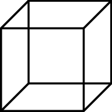

Many images here are created with the help of LaTeX and or Tikz.  All due credit to the authors of these amazing tools.

To use them as images we are using the `standalone` class in latex.  Here are the steps.

```
\documentclass{standalone}
\usepackage{tikz}
\author{CC-BY-2016 James B. Wilson}
\date{2016}
\date{today}
\begin{document}
\begin{tikzpicture}[scale=.2]
\draw[thick] (0,2) -- (0,8) -- (6,8) -- (6,2) -- (4,0) -- (-2,0) -- (0,2);
\draw[thick] (-2,0) -- (-2,6) -- (0,8);
\draw[thick] (4,0) -- (4,6) -- (6,8);
\draw[thick] (-2,6) -- (4,6);
\draw[thick] (0,2) -- (6,2);
\node at (2,4) {T};
\end{tikzpicture}
\end{document}
```

## Compiling the file to a PNG.

To make graphic on linux/OSX....(require ImageMagic installed)
```
$ pdflatex thisfile.tex
$ convert -density 300 thisfile.pdf -resize 640x480 thatfile.png 
```
On Windows 10.... copy ImageMagic's convert.exe to your path or rename it imgconvert.exe
Get recent version of GhostScript (See details below).
```
pdflatex thisfile.tex
convert -density 300 thisfile.pdf -resize 640x480 thatfile.png 
```
This should create a PDF (which you don't need and can delete or add to `.gitignore`) and an `.png`, the above example for instance:



Trouble? Everything I know about it I found on [this very useful thread](https://tex.stackexchange.com/questions/11866/compile-a-latex-document-into-a-png-image-thats-as-short-as-possible/11880#11880)

---
**TODO** This will make a pdf.  You could ignore it and just add the png, 
and even that doesn't belong here as we want the png for webpages.  But I'll leave it here until I design a better system.
